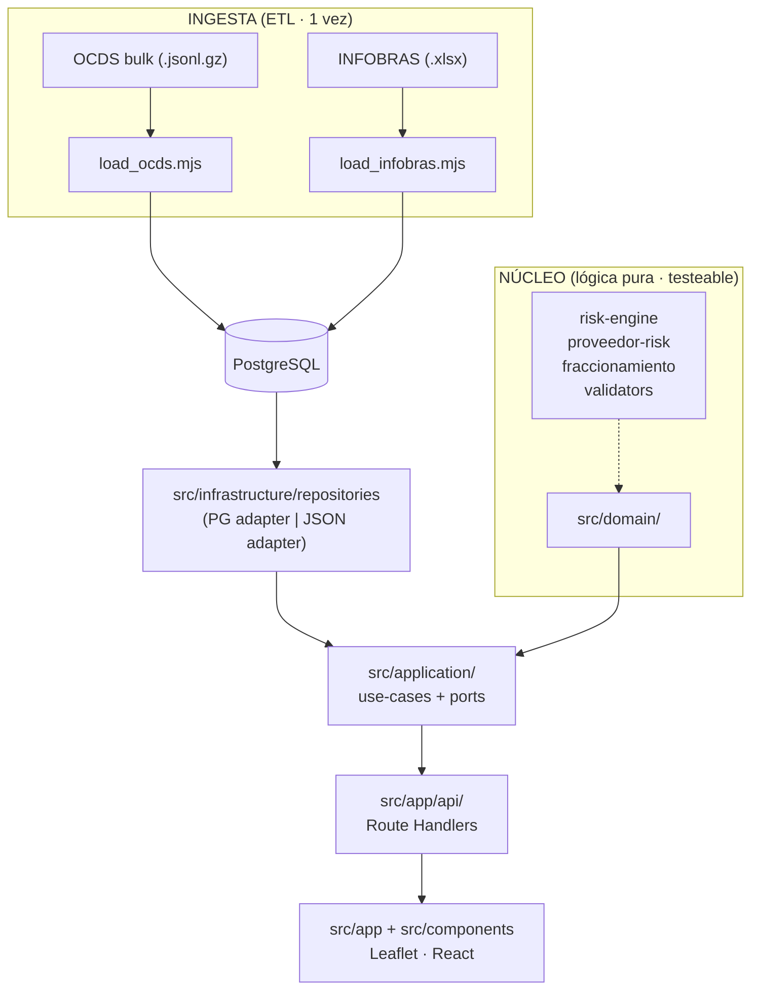

# Lupa Fiscal — Radar ciudadano de obras públicas paralizadas

Plataforma de señales de riesgo sobre datos abiertos del Estado peruano. Un mismo motor de reglas, tres públicos: ciudadano, entidad pública y empresa privada. Construida sobre OCDS (OECE/SEACE) e INFOBRAS (Contraloría), con arquitectura hexagonal en capas y un motor de reglas puro y testeable.

> 2,700+ obras públicas paralizadas · S/ 67,139 M de inversión congelada (Corte 2025 · INFOBRAS)

---

## Tabla de contenidos

- [Usuarios y casos de uso](#usuarios-y-casos-de-uso)
- [Arquitectura](#arquitectura)
- [Estructura del repositorio](#estructura-del-repositorio)
- [Motor de señales de riesgo](#motor-de-señales-de-riesgo)
- [Autenticación y sesiones](#autenticación-y-sesiones)
- [API](#api)
- [ETL y datos](#etl-y-datos)
- [Stack tecnológico](#stack-tecnológico)
- [Cómo correr el proyecto](#cómo-correr-el-proyecto)
- [Testing](#testing)
- [Despliegue](#despliegue)
- [Decisiones de arquitectura (ADRs)](#decisiones-de-arquitectura-adrs)
- [Configuración de entorno](#configuración-de-entorno)

---

## Usuarios y casos de uso

### 1. Ciudadano — vigilancia (`/plataforma` → Vista ciudadano)
Busca tu departamento y ve las contrataciones públicas del Estado con señales de riesgo en el contrato que las financió. Mapa Leaflet con obras geocodificadas por ubigeo, lista ordenada por puntaje de riesgo, y ficha lateral con el detalle: monto pagado vs. estimado, proveedor, número de postores, estado de la obra, y cada bandera explicada en lenguaje simple. Botones para reportar a la Contraloría (SINAD) o pedir acceso a la información pública (Ley 27806).

### 2. Entidad pública — contratación responsable (`/plataforma` → Vista proveedor)
Antes de adjudicar, busca un proveedor por RUC y revisa su perfil de riesgo agregado: sanciones e inhabilitaciones, historial de postor único, sobrecostos, concentración con una sola entidad compradora (HHI + top-1 share), y obras paralizadas asociadas. Semáforo verde/ámbar/rojo.

### 3. Empresa privada — debida diligencia (Ley 30424) (`/buscar-proveedor`)
La misma consulta por RUC que la ley anticorrupción obliga a hacer sobre proveedores, clientes y socios de negocio. El semáforo de integridad en compra pública de tu contraparte, en segundos.

---

## Arquitectura

Arquitectura hexagonal en capas. Las dependencias se dirigen hacia adentro: Presentation → Application → Domain. `infrastructure/` implementa los puertos declarados en `application/`. `domain/` no importa framework, DB ni React.



| Capa              | Directorio                                          | Responsabilidad                                                                 |
|-------------------|-----------------------------------------------------|---------------------------------------------------------------------------------|
| Ingesta           | `etl/`                                              | Descarga/parseo OCDS + INFOBRAS, normaliza a Postgres o `data/seed.json`.       |
| Dominio           | `src/domain/`                                      | Entidades, motor de riesgo, validadores. Puro, sin deps externas. + tests.       |
| Aplicación        | `src/application/`                                 | Casos de uso + puertos (`ObrasRepository`, `CryptoPort`, `CaptchaVerifier`).     |
| Infraestructura   | `src/infrastructure/`                             | `db/` (Pool + schema), `repositories/` (PG/JSON), `auth/` (captcha + session). |
| Presentación      | `src/app/`, `src/components/`, `src/lib/`         | Next.js App Router, Route Handlers, Leaflet, helpers de formato.               |

Decisión clave: la fábrica `getObrasRepository()` elige adaptador Postgres o `seed.json` según exista `DATABASE_URL` ([ADR-0001](docs/adr/ADR-0001.md)); la separación en capas se formaliza en [ADR-0004](docs/adr/ADR-0004.md).

---

## Estructura del repositorio

```
estado-peruano/
├── etl/                              # ETL (plain .mjs, fuera del tsconfig)
│   ├── load_ocds.mjs                 # Carga real OCDS (publication 135) → Postgres
│   ├── load_infobras.mjs             # Carga INFOBRAS (.xlsx) → cruce por CUI
│   ├── etl_ocds.mjs                  # CLI sanity tool (espejo del motor de riesgo)
│   ├── build_seed.mjs                # Valida data/seed.json + reporta cifras
│   ├── db_setup.mjs                  # Aplica schema.sql + carga seed.json
│   └── sample.jsonl                  # Muestra OCDS de prueba (6 líneas)
├── data/
│   ├── seed.json                     # Semilla demo (migrada a Postgres por db_setup)
│   ├── ubigeo.csv                    # Tabla INEI para geocodificación
│   └── seed/{obras,contratos,proveedores}.json
├── scripts/
│   └── validar_fuentes.sh           # Ping a las 4 fuentes de datos del Estado
├── docs/
│   ├── architecture.md               # Diagramas C4 + descripción de capas
│   ├── adr/                          # ADR-0001 .. ADR-0004
│   ├── datos.md                      # Fuentes y endpoints de datos
│   ├── modelo-datos.md               # Modelo de datos
│   └── motor-riesgo-y-fuentes.md     # Detalle del motor y fuentes
├── src/
│   ├── domain/                       # NÚCLEO (puro, cero deps externas)
│   │   ├── entities.ts               # Entidad · Obra · Contrato · Proveedor · Bandera
│   │   ├── auth-entities.ts          # Usuario · Sesion · ConsultaLog · Roles
│   │   ├── risk-engine.ts            # Motor por-contrato (5 banderas)
│   │   ├── proveedor-risk.ts         # Motor agregado por-RUC (5 banderas + HHI)
│   │   ├── fraccionamiento.ts        # Detección de fraccionamiento (bandera agregada)
│   │   ├── validators.ts             # validarDni · validarRuc · tipoRuc
│   │   └── *.test.ts                 # Suites Vitest (4 archivos de tests)
│   ├── application/                  # Casos de uso + puertos
│   │   ├── ports.ts                  # ObrasRepository + DTOs
│   │   ├── use-cases.ts              # listarRegiones · buscarObras · obtenerDetalleObra
│   │   └── auth-use-cases.ts          # registrarCiudadano · registrarEmpresa · login
│   ├── infrastructure/              # Adaptadores
│   │   ├── db/
│   │   │   ├── client.ts             # pg.Pool singleton (lazy)
│   │   │   └── schema.sql            # Tablas entidad · proveedor · contrato · obra
│   │   ├── repositories/
│   │   │   ├── index.ts              # Factory: PG si DATABASE_URL, JSON si no
│   │   │   ├── pg-obras-repository.ts
│   │   │   └── json-obras-repository.ts
│   │   └── auth/
│   │       ├── session.ts            # scrypt + HMAC-SHA256 (node:crypto)
│   │       └── captcha-store.ts       # Captcha server-side, single-use, TTL 5min
│   ├── app/                          # Next.js App Router
│   │   ├── layout.tsx                # Root layout + metadata
│   │   ├── page.tsx                  # Landing (Server Component)
│   │   ├── plataforma/page.tsx      # Shell con switch ciudadano/proveedor
│   │   ├── login/page.tsx           # Form de login (client)
│   │   ├── registro/page.tsx        # Form de registro multi-rol (client)
│   │   ├── buscar-proveedor/page.tsx
│   │   ├── globals.css              # Tokens de diseño + estilos
│   │   └── api/                      # Route Handlers
│   │       ├── obras/route.ts
│   │       ├── obras/[id]/route.ts
│   │       ├── regiones/route.ts
│   │       ├── proveedores/[ruc]/route.ts
│   │       ├── captcha/route.ts
│   │       └── auth/{login,register}/route.ts
│   ├── components/                   # React client components
│   │   ├── VistaCiudadano.tsx        # Dashboard del ciudadano (mapa + ficha)
│   │   ├── VistaProveedor.tsx        # Due-diligence por RUC
│   │   ├── MapaObras.tsx             # Leaflet (dynamic import, SSR off)
│   │   ├── PerfilRiesgo.tsx          # Render del PerfilRiesgoProveedor
│   │   ├── Captcha.tsx              # Widget que pide reto a /api/captcha
│   │   ├── ObraCard.tsx             # Tarjeta de obra + solicitud Ley 27806
│   │   └── Info.tsx                 # Tooltip accesible ("?")
│   └── lib/
│       └── format.ts                 # money · moneyCorto · colorNivel · nombreBandera
├── docker-compose.yml               # postgres:16 + app en :3100
├── Dockerfile                       # node:20-alpine + db_setup al arranque
├── next.config.mjs
├── tsconfig.json                     # ES2021, strict, alias @/* → ./src/*
├── vitest.config.ts
└── package.json
```

---

## Motor de señales de riesgo

El núcleo de Lupa Fiscal. Cada bandera es una **función pura** sobre el contexto del contrato (más proveedor/obra opcional). El puntaje es la suma de pesos. No es una caja negra: cada bandera explica su motivo.

### Motor por-contrato (`src/domain/risk-engine.ts`)

Aplica a un contrato individual. Lo consume `buscarObras` (vista ciudadano) y el detalle de cada contrato en el perfil de proveedor.

| Bandera                   | Peso | Condición                                                              |
|---------------------------|------|------------------------------------------------------------------------|
| `POSTOR_UNICO`            | 3    | `numPostores === 1` (sin competencia)                                 |
| `SOBRECOSTO`              | 2    | `(montoAdj − valorRef) / valorRef > 0.15`                            |
| `PROVEEDOR_RECURRENTE`    | 1    | `proveedor.numAdjudicaciones ≥ 3`                                     |
| `PROVEEDOR_SANCIONADO`    | 3    | `proveedor.sancionado === true` (RNSSC)                              |
| `OBRA_ATRAPADA`           | 2    | Paralizada >6 meses con `avanceFisico ≥ 50%` (plata ya invertida)    |

Clasificación: `≥5` alto · `≥2` medio · `0–1` bajo.

### Motor agregado por-RUC (`src/domain/proveedor-risk.ts`)

Perfila un proveedor con **todos** sus contratos. Señales que solo existen a nivel agregado (patrones, no eventos sueltos):

| Bandera                          | Peso | Condición                                                              |
|----------------------------------|------|------------------------------------------------------------------------|
| `CONC_POSTOR_UNICO`             | 1–3  | 30–59% ámbar (peso 1) · ≥60% rojo (peso 3) de adjudicaciones a dedo  |
| `PATRON_SOBRECOSTOS`            | 1–2  | 1–2 contratos ámbar · ≥3 rojo con sobrecosto >15%                   |
| `CAPTURA_COMPRADOR`             | 1–2  | top-1 share ≥50% ámbar · ≥70% o HHI ≥0.5 rojo (monopsonio)          |
| `PROVEEDOR_SANCIONADO` (agg)    | 3    | Sanción vigente → escalada directa a rojo                            |
| `OBRAS_PARALIZADAS_PROVEEDOR`   | 1–2  | 1 obra ámbar · ≥2 rojo, con monto de plata expuesta                  |

Semáforo híbrido: por puntaje (`≥6` rojo · `≥3` ámbar · `0–2` verde) **o** escalada directa a rojo ante sanción vigente.

Métricas expuestas en la ficha: totalContratos, pctPostorUnico, shareTopComprador, hhiCompradores, numCompradores, numSobrecostos, obrasParalizadas, inversionParalizada.

### Fraccionamiento (`src/domain/fraccionamiento.ts`)

Banderada agregada a nivel entidad+proveedor: agrupa por `(entidadId, proveedorId)` y marca grupos con ≥2 contratos individualmente bajo `UMBRAL_FRACCIONAMIENTO = S/ 8,000,000` cuya suma lo supera. Peso 3 (posible elusión de licitación pública).

### Validadores peruanos (`src/domain/validators.ts`)

- `validarDni(dni)` — 8 dígitos, verificador opcional por forma, rechaza centinela `00000000`.
- `validarRuc(ruc)` — 11 dígitos, prefijo válido (`{10,15,16,17,20}`), dígito verificador módulo-11. Verificado contra RUCs reales (BCP, SUNAT, MEF, Telefónica).
- `tipoRuc(ruc)` — `"natural" | "juridica"` según prefijo.

Todos los umbrales son constantes exportadas y testeables (`UMBRAL_SOBRECOSTO`, `UMBRAL_RECURRENTE`, `UMBRAL_PCT_POSTOR_UNICO_ROJO`, etc.).

---

## Autenticación y sesiones

```
registro/login ─→ AuthDeps (UsersRepo · SessionsRepo · CryptoPort · CaptchaVerifier)
                              │
                              ▼
              infrastructure/auth/session.ts (node:crypto)
                ├── hashPassword (scrypt N=16384, r=8, p=1, 16B salt, 64B keylen)
                ├── verificarPassword (timingSafeEqual)
                ├── firmarSession (HMAC-SHA256, AUTH_SECRET)
                └── nuevoSessionId (32 random bytes base64url)
```

**Seguridad aplicada:**
- **Hash de password** — scrypt (memory-hard), formato autodescriptivo `scrypt$N$r$p$saltB64$hashB64` para poder subir parámetros sin romper hashes antiguos.
- **Cookie httpOnly** `lf_session` con valor `${sessionId}.${firmaHMAC}`. El sessionId es opaco (no lleva datos del usuario); la firma garantiza integridad. `secure` en producción, `sameSite=lax`, 7 días.
- **Anti-enumeración de cuentas** — el login devuelve el mismo mensaje genérico "Credenciales inválidas" para email inexistente o password incorrecta, y ejecuta una verificación dummy para no filtrar por tiempo.
- **Captcha server-side** — el servidor genera `a + b` con `node:crypto`, guarda la solución en `globalThis` (single-use, TTL 5 min), el cliente solo recibe `{token, a, b}`. `verificarReto(token)` consume el reto. Bypass por `CAPTCHA_BYPASS_TOKEN` para CI/curl.
- **El `passwordHash` jamás cruza el límite application → app** — los casos de uso devuelven `Usuario`, nunca `UsuarioConCredencial`.

**Deuda técnica marcada en código:**
- El `AuthStore` de usuarios/sesiones vive en `globalThis.__lupaFiscalAuthStore__` (in-memory). Migrar a Postgres exige añadir tablas `usuario`/`sesion`/`consulta_log` (no presentes aún en `schema.sql`).
- El bloque de wiring `AuthDeps` está duplicado en `auth/login` y `auth/register` (refactor pendiente: extraer a `infrastructure/auth/deps.ts`).
- El modelo de auditoría `ConsultaLog` está declarado en `auth-entities.ts` pero no hay repository ni middleware que lo persista.
- No existe `middleware.ts` de Next.js para proteger rutas — el cookie solo se setea en login/register.

---

## API

Todos los Route Handlers declaran `runtime = "nodejs"` y `dynamic = "force-dynamic"`.

| Método | Ruta                          | Descripción                                           | Archivo                       |
|--------|-------------------------------|-------------------------------------------------------|-------------------------------|
| GET    | `/api/regiones`               | Agregados por región (totales · paralizadas · congelada) | `api/regiones/route.ts`      |
| GET    | `/api/obras?region=&categoria=` | Obras evaluadas por región (top 300), opcional filtro por categoría OCDS | `api/obras/route.ts` |
| GET    | `/api/obras/:id`               | Detalle de una obra ya evaluada                       | `api/obras/[id]/route.ts`    |
| GET    | `/api/proveedores/:ruc`        | Perfil de riesgo agregado + top-50 contratos por monto | `api/proveedores/[ruc]/route.ts` |
| GET    | `/api/captcha`                | Emite reto `{token, a, b}`                            | `api/captcha/route.ts`       |
| POST   | `/api/auth/login`             | Login + setea cookie                                  | `api/auth/login/route.ts`    |
| POST   | `/api/auth/register`          | Registro ciudadano o empresa + setea cookie           | `api/auth/register/route.ts` |

**Dual datasource:** todas las respuestas de obras/regiones/proveedores incluyen `"fuente": "postgres" | "seed"` para transparencia. La factory `getObrasRepository()` elige adaptador al arranque.

---

## ETL y datos

### Pipeline en dos fases

```
FASE 1: OCDS (OECE/SEACE, publication 135)          FASE 2: INFOBRAS (Contraloría)
┌─────────────────────────────┐                    ┌────────────────────────────┐
│ .jsonl.gz (streaming)        │                    │ .xlsx (~56MB, leído con xlsx)│
│   ↓ load_ocds.mjs           │                    │   ↓ load_infobras.mjs      │
│ • buyer.address.DEPARTMENT →│ región             │ • Nombres de columna         │
│ • strip "PE-RUC-" → RUC     │                    │   tolerantes (NFD + substring)│
│ • geocode por ubigeo.csv    │                    │ • estado normalizado         │
│   (distrito→provincia→dep)  │                    │   → paralizada/en_ejecucion/ /// │
│ • jitter si hay duplicados  │                    │   concluida/desconocido       │
│ • CUI = planning.budget     │                    │ • CRUCE por CUI:              │
│   .projectID                │                    │   obra.estado = infobras.estado│
│ • TRUNCATE + batch 800      │                    │   obra.avance = infobras.avance│
│ • num_adjudicaciones global │                    │                              │
└─────────────────────────────┘                    └────────────────────────────┘
              ↓                                                     ↓
              └──────────────→ PostgreSQL (Supabase/Neon) ←─────────┘
```

OCDS aporta: entidad, proveedor, contrato (ocid, cui, valorReferencial, montoAdjudicado, numPostores). **No** tiene estado/avance de obra.
INFOBRAS aporta: estado real (paralizada), avance físico, costo. El cruce por CUI conecta "obra parada" ↔ "contrato que la pagó".

### Fallback demo: `data/seed.json`

Si `DATABASE_URL` no está definida, la app usa `JsonObrasRepository` (carga `data/seed.json` en memoria). Esto permite correr la demo sin DB. `db_setup.mjs` aplica `schema.sql` y carga el seed en Postgres (con guard: si ya hay >100 obras, no sobreescribe data real).

### Scripts

```bash
npm run etl        # node etl/etl_ocds.mjs (CLI sanity tool, lee sample.jsonl)
npm run seed       # node etl/build_seed.mjs (valida seed + reporta cifras)
npm run db:setup   # node etl/db_setup.mjs (schema + seed a Postgres)
```

Para carga real de OCDS e INFOBRAS ver las cabeceras de `etl/load_ocds.mjs` y `etl/load_infobras.mjs` — requieren `DATABASE_URL` y el archivo de entrada como argumento.

### Fuentes de datos

- OCDS bulk: `data.open-contracting.org/.../publication/135` (CC BY 4.0)
- INFOBRAS: `infobras.contraloria.gob.pe/InfobrasWeb/DataSets` (descarga por navegador)
- Ubigeo: `data/ubigeo.csv` (INEI/RENIEC)
- `scripts/validar_fuentes.sh` hace ping a las 4 fuentes antes de una corrida ETL.

Ver `docs/datos.md` para el detalle de endpoints y `docs/modelo-datos.md` para el modelo.

---

## Stack tecnológico

| Capa           | Tecnología                                                              |
|----------------|-------------------------------------------------------------------------|
| Framework      | Next.js 14.2.18 (App Router) + React 18 + TypeScript 5.6 (strict, ES2021) |
| Mapa           | Leaflet 1.9 (dynamic import, SSR desactivado)                         |
| API            | Route Handlers de Next.js (runtime nodejs, force-dynamic)             |
| Persistencia   | PostgreSQL gestionado (Supabase/Neon) + `pg` 8.13                      |
| ETL            | Node.js puro (`.mjs`) + `xlsx` para INFOBRAS                            |
| Auth           | `node:crypto` (scrypt + HMAC-SHA256), sin libs externas                |
| Testing        | Vitest 2.1 (tests al lado del dominio, `*.test.ts`)                    |
| Despliegue     | Vercel (Next.js) · o Docker Compose (postgres:16 + app en :3100)        |
| Node           | `>=18.18` (probado con 20 y 22)                                        |

---

## Cómo correr el proyecto

### Requisitos
- Node `>=18.18`
- (Opcional) PostgreSQL o una URL de Supabase/Neon. Sin `DATABASE_URL` la app usa `data/seed.json`.

### Local (modo demo, sin DB)

```bash
git clone <repo> && cd estado-peruano
npm install
npm run dev          # http://localhost:3000 (usa seed.json)
```

### Local con Postgres propio (docker-compose)

```bash
docker compose up --build
# App: http://localhost:3100 · Postgres: localhost:5433
# db_setup.mjs corre automáticamente al arranque (schema + seed)
```

### Local con Supabase/Neon

```bash
cp .env.example .env
# Completar DATABASE_URL=postgresql://...
npm install
npm run db:setup     # aplica schema.sql + carga seed.json a Postgres
npm run dev
```

### Carga de datos reales (ETL)

```bash
# FASE 1: OCDS
curl -L -o data/2025.jsonl.gz \
  "https://data.open-contracting.org/en/publication/135/download?name=2025.jsonl.gz"
DATABASE_URL="postgres://..." node etl/load_ocds.mjs data/2025.jsonl.gz

# FASE 2: INFOBRAS (descargar .xlsx por navegador desde infobras.contraloria.gob.pe)
DATABASE_URL="postgres://..." node etl/load_infobras.mjs data/infobras-obras.xlsx
```

---

## Testing

Los tests viven al lado del dominio (`src/domain/*.test.ts`), corren sin DB ni framework.

```bash
npm test              # vitest run (suite completa)
npm run test:watch    # modo watch
```

Suites:
- `risk-engine.test.ts` — camino feliz + casos de error del motor por-contrato (5 banderas).
- `proveedor-risk.test.ts` — motor agregado por-RUC (HHI, share, semáforo, escalada por sanción).
- `fraccionamiento.test.ts` — detección de grupos sospechosos.
- `validators.test.ts` — DNI/RUC (forma, prefijo, dígito verificador módulo-11, RUCs reales).

Cobertura del camino feliz y de casos de error de la funcionalidad crítica, defendible en Q&A.

---

## Despliegue

### Vercel (recomendado para Next.js)
- Variable `DATABASE_URL` en el dashboard de Vercel (Supabase/Neon).
- El timestamp del deploy sirve de verificación de que la URL de producción está viva.
- Ver [ADR-0003](docs/adr/ADR-0003.md).

### Docker Compose
- `docker compose up --build` levanta `postgres:16-alpine` (puerto 5433) + app (puerto 3100).
- `Dockerfile` (node:20-alpine): `npm ci` → `npm run build` → al arranque, si hay `DATABASE_URL`, corre `db_setup.mjs` (schema + seed) y luego `npm start`.

---

## Decisiones de arquitectura (ADRs)

| ADR | Título | Estado |
|-----|--------|--------|
| [ADR-0001](docs/adr/ADR-0001.md) | Precargar datos vía ETL en vez de llamar APIs en vivo | Aceptada |
| [ADR-0002](docs/adr/ADR-0002.md) | Motor de reglas como funciones puras en el dominio | Aceptada |
| [ADR-0003](docs/adr/ADR-0003.md) | Next.js + Postgres gestionado sobre Vercel | Aceptada |
| [ADR-0004](docs/adr/ADR-0004.md) | Estructura hexagonal en capas bajo `src/` | Aceptada |

Documentación adicional en `docs/`:
- [`architecture.md`](docs/architecture.md) — diagramas C4 + descripción de capas
- [`datos.md`](docs/datos.md) — fuentes y endpoints de datos
- [`modelo-datos.md`](docs/modelo-datos.md) — modelo de datos
- [`motor-riesgo-y-fuentes.md`](docs/motor-riesgo-y-fuentes.md) — detalle del motor y fuentes

---

## Configuración de entorno

| Variable                | Requerida | Descripción                                                              |
|-------------------------|-----------|--------------------------------------------------------------------------|
| `DATABASE_URL`          | No*       | URL de Postgres (Supabase/Neon). Sin ella, app usa `seed.json`.         |
| `AUTH_SECRET`           | Sí en prod| Secreto HMAC (≥32 bytes). En dev hay fallback con aviso.                 |
| `CAPTCHA_BYPASS_TOKEN`  | No        | Token fijo para CI/curl. Si se setea, acepta ese valor como captcha válido. |
| `NODE_ENV`              | —         | `production` activa `secure` en cookie y exige `AUTH_SECRET` real.       |

\* La app arranca sin `DATABASE_URL` (modo demo con seed), pero el riesgo por-RUC y las regiones solo tienen data real si hay Postgres cargado por la ETL.

Ver `.env.example` para el template.

---

## Integrantes y roles

| Integrante      | Rol                                 | Defiende en el Q&A                          |
|-----------------|-------------------------------------|---------------------------------------------|
| [Bruno]         | Datos & ETL · modelo de datos         | Cómo se cargan y normalizan los datos       |
| [Alexander F]   | Dominio · motor de reglas · tests     | Por qué cada bandera y cómo se valida       |
| [Jorge Nureña]  | API · UI/Mapa · despliegue            | Cómo se consume y por qué la demo es estable |

## Modelos y herramientas de IA

Se usa IA generativa como **copiloto de ingeniería**, no como caja negra: para validar decisiones de arquitectura, generar boilerplate y tests, y explicar código mientras se construye. Cada integrante es dueño de sus módulos para sustentarlos en el Q&A.

- **Claude (Opus / Sonnet)** — arquitectura, ETL, tests
- **IA para documentación y diagramas** — asistente de editor
- **Asistente de editor (Copilot / Cursor)**