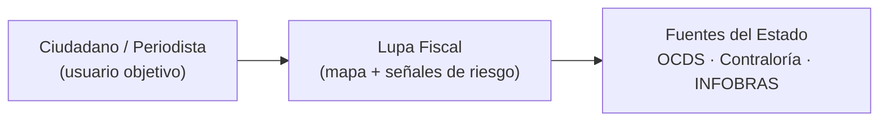
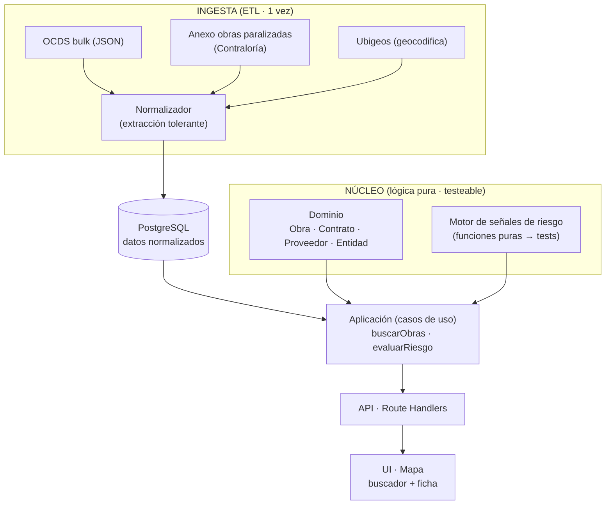
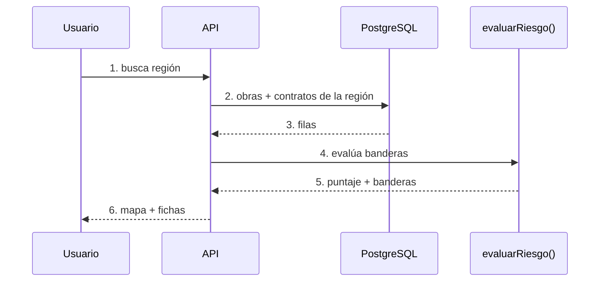

# Arquitectura — Lupa Fiscal

Modelo en capas (estilo C4). La lógica de negocio no depende de framework ni base de datos: por eso es testeable y defendible.

## 2.1 Contexto

Nivel 1 — El sistema, su usuario y las fuentes de datos del Estado.

## 2.2 Contenedores y capas

Nivel 2 — Capas y contenedores. La ETL deja la base lista; el núcleo no conoce ni framework ni DB.

| Capa           | Responsabilidad                                                                                           |
|----------------|-----------------------------------------------------------------------------------------------------------|
| `etl/`         | Descarga, parseo y normalización de fuentes. Corre una vez y deja Postgres listo para una demo estable.  |
| `domain/`      | Entidades y motor de señales de riesgo. Cero dependencias externas. Aquí viven los tests.                 |
| `application/` | Casos de uso que orquestan dominio + repositorios.                                                        |
| `infrastructure/` | Repositorios Postgres, API (Route Handlers), UI con mapa.                                              |

## 2.3 Flujo de la funcionalidad crítica

Nivel 3 — Camino feliz de la funcionalidad crítica (la que se demuestra en vivo y la que cubren los tests).

**Decisión clave:** los datos se precargan (ETL) en vez de llamar APIs del Estado en vivo, para que la demo de las 6 pm no dependa de que un portal externo esté arriba. Ver [ADR-0001](./adr/ADR-0001.md).