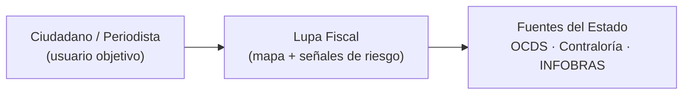
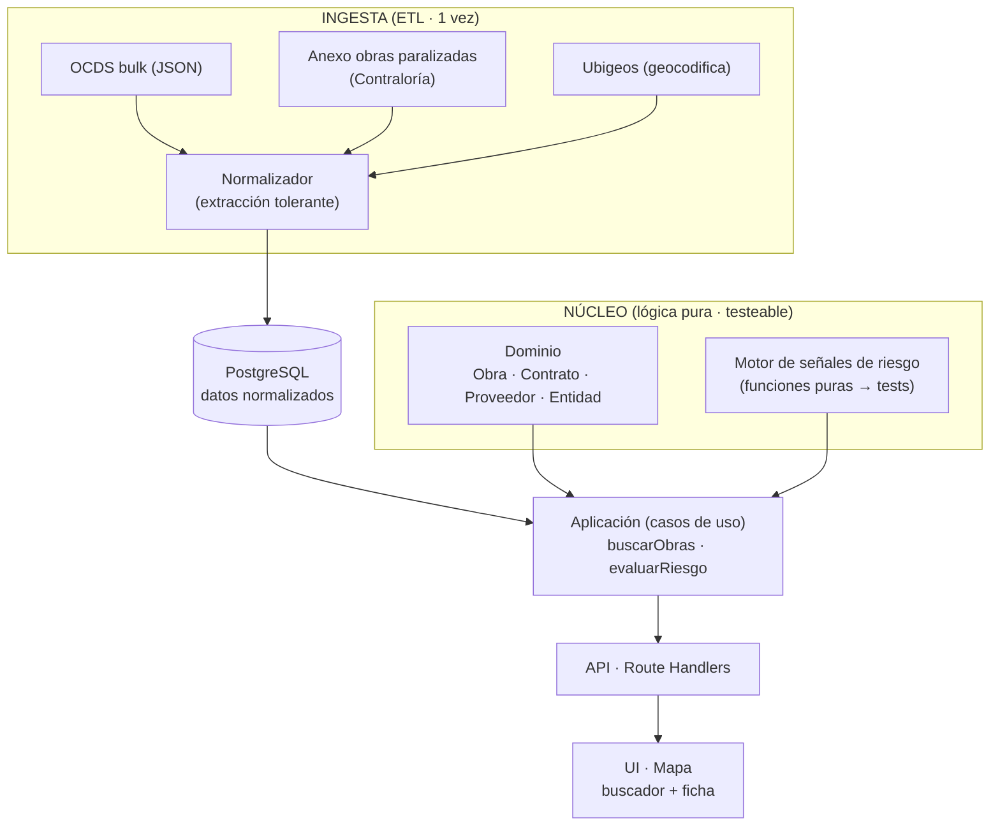
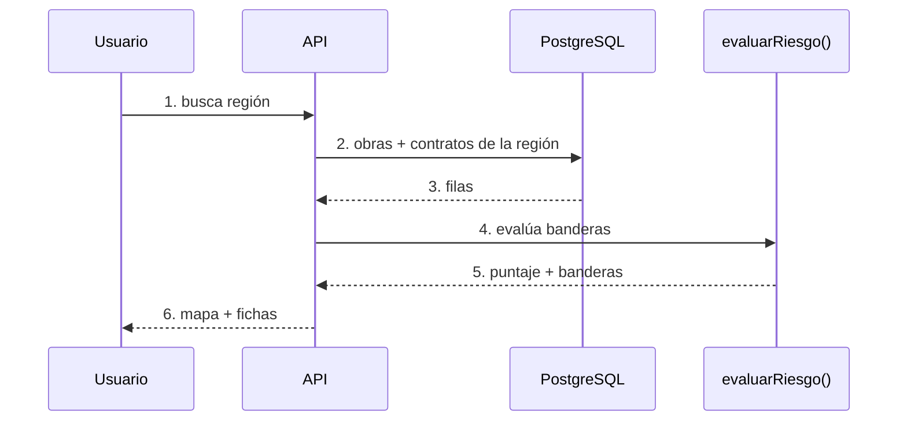

# Arquitectura — Lupa Fiscal

Modelo en capas (estilo C4). La lógica de negocio no depende de framework ni base de datos: por eso es testeable y defendible.

## 2.1 Contexto

Nivel 1 — El sistema, su usuario y las fuentes de datos del Estado.

## 2.2 Contenedores y capas

Nivel 2 — Capas y contenedores. La ETL deja la base lista; el núcleo no conoce ni framework ni DB.

Las dependencias se dirigen hacia adentro: la presentación (`app/`, `components/`, `lib/`) puede importar `application/` y `domain/`; `infrastructure/` implementa los puertos declarados en `application/`; `domain/` no importa framework ni DB.

| Capa              | Directorio              | Responsabilidad                                                                                                              |
|-------------------|-------------------------|------------------------------------------------------------------------------------------------------------------------------|
| Ingesta           | `etl/`                  | Descarga/parseo OCDS + INFOBRAS, normaliza a Postgres o a `data/seed.json`. Corre una vez y deja la base lista.              |
| Dominio           | `src/domain/`          | Entidades, `risk-engine`, `proveedor-risk`, `fraccionamiento`, `validators`. Puro, sin deps externas. Aquí viven los tests.   |
| Aplicación        | `src/application/`     | Casos de uso (`use-cases.ts`, `auth-use-cases.ts`) y puertos (`ports.ts`): `ObrasRepository`, `CryptoPort`, `CaptchaVerifier`.|
| Infraestructura   | `src/infrastructure/`  | Adaptadores: `db/client.ts` + `schema.sql`, repositorios PG/JSON (`repositories/`), `auth/{captcha-store,session}.ts`.      |
| Presentación      | `src/app/`, `src/components/`, `src/lib/` | Next.js App Router: landing, `/plataforma`, `/login`, `/registro`, `/buscar-proveedor`; route handlers en `app/api/`; mapas Leaflet y helpers de formato. |

Decisión clave: la fábrica `getObrasRepository()` elige adaptador Postgres o `seed.json` según exista `DATABASE_URL` (ver [ADR-0001](./adr/ADR-0001.md)); la separación en capas y sus reglas de dependencia se formalizan en [ADR-0004](./adr/ADR-0004.md).

## 2.3 Flujo de la funcionalidad crítica

Nivel 3 — Camino feliz de la funcionalidad crítica (la que se demuestra en vivo y la que cubren los tests).

**Decisiones clave:** los datos se precargan (ETL) en vez de llamar APIs del Estado en vivo, para que la demo de las 6 pm no dependa de que un portal externo esté arriba. Ver [ADR-0001](./adr/ADR-0001.md); la estructura hexagonal en capas se documenta en [ADR-0004](./adr/ADR-0004.md).