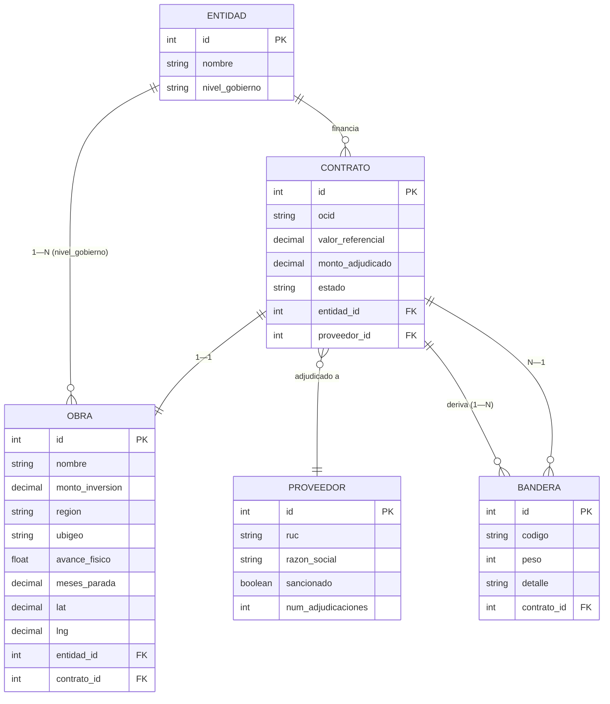

# Modelo de datos — Lupa Fiscal

Modelo normalizado mínimo para sostener el mapa, la ficha y el motor de banderas.

- Una **Obra** está financiada por un **Contrato**; el Contrato tiene un **Proveedor** y genera **Banderas** derivadas por el motor de riesgo.

**Geocodificación.** Si la obra solo trae distrito o código `ubigeo`, se obtiene `lat/lng` del centroide cruzando con los datasets oficiales de Ubigeos (INEI) y Centros Poblados (IGN).