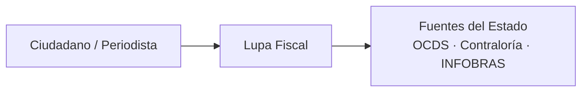
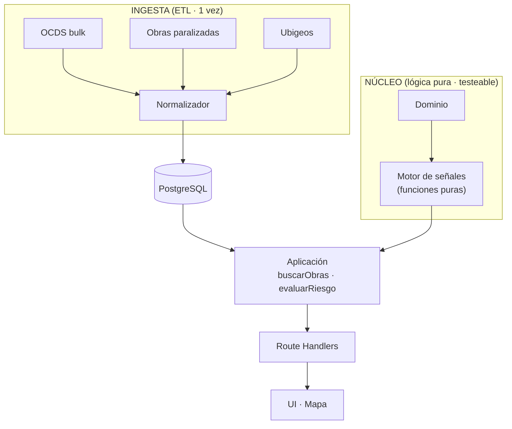
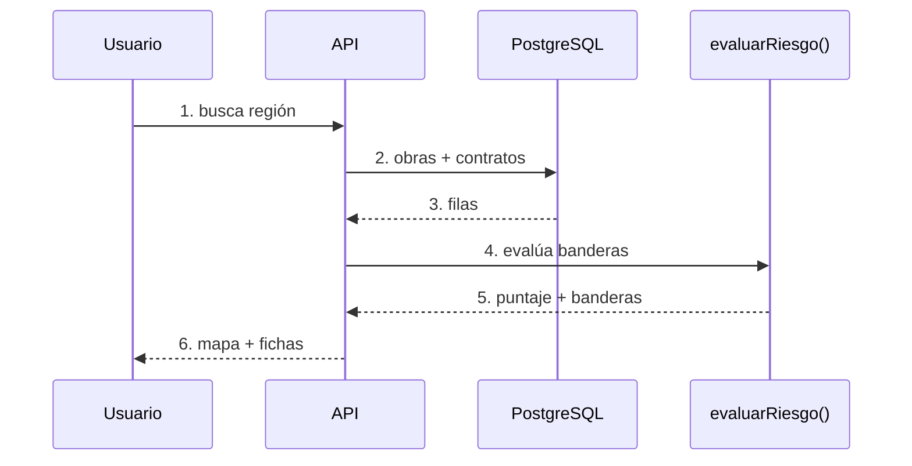
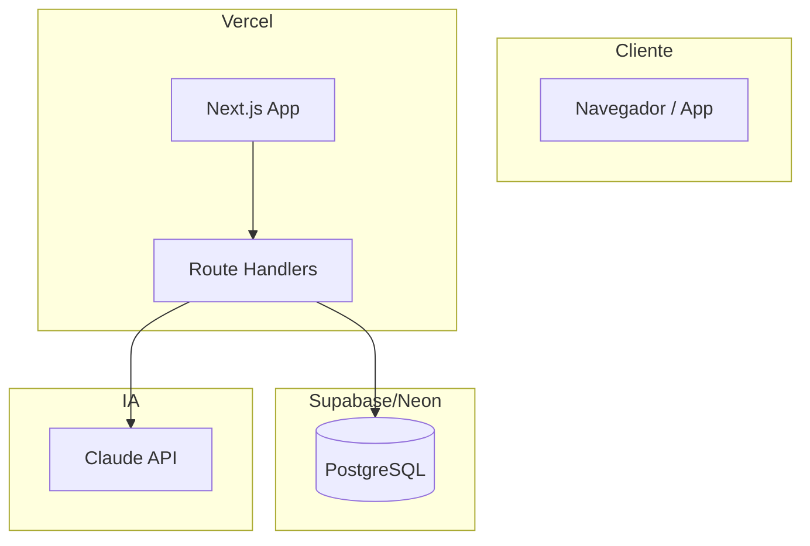

# Plantilla - Hito 1: Prototipo de arquitectura (Lupa Fiscal)

> Estado de los checks del Hito 1 para Lupa Fiscal.

---

## Checklist final

- [x] Repositorio público en GitHub creado → https://github.com/lexand-dev/lupa-fiscal
- [x] `README.md` completo con todas las secciones
- [x] Carpeta `/docs` con `architecture.md` (diagramas C4 en mermaid)
- [x] `modelo-datos.md` (diagrama ER)
- [x] `motor-riesgo-y-fuentes.md` (banderas + fuentes verificadas)
- [x] `datos.md` (endpoints y descargas)
- [x] ADRs en `/docs/adr/` (ADR-0001, ADR-0002, ADR-0003)
- [ ] Reemplazar `[Nombre 1/2/3]` por integrantes reales
- [ ] URL de producción en Vercel (deploy vivo)
- [ ] Commit y push de todos los archivos al repositorio
- [ ] Release creada con título: **Prototipo de arquitectura - Lupa Fiscal**
  ```bash
  gh release create v0.1.0 \
    --title "Prototipo de arquitectura - Lupa Fiscal" \
    --notes "Primer prototipo de arquitectura y documentación del proyecto." \
    --repo lexand-dev/lupa-fiscal
  ```

---

## Estructura final del repositorio

```
lupa-fiscal/
├── README.md
├── docs/
│   ├── architecture.md            (C4: contexto, contenedores, flujo crítico)
│   ├── modelo-datos.md            (diagrama ER)
│   ├── motor-riesgo-y-fuentes.md  (banderas + fuentes verificadas)
│   ├── datos.md                   (endpoints y descargas OCDS)
│   └── adr/
│       ├── ADR-0001.md            (ETL vs APIs en vivo)
│       ├── ADR-0002.md            (reglas como funciones puras)
│       └── ADR-0003.md            (Next.js + Postgres en Vercel)
└── [código del prototipo]
```

---

## Plantillas de contenido

### 1. README.md

```markdown
# Lupa Fiscal

Plataforma cívica que permite a cualquier ciudadano buscar su región y ver las obras públicas paralizadas cerca,
cuánta inversión está congelada y qué señales de riesgo tiene el contrato que las financió.
Radar ciudadano de obras públicas paralizadas y señales de riesgo en sus contrataciones.

## Problemática y usuario

**Problema.** A inicios de 2026 hay más de 2,700 obras públicas paralizadas en el Perú, con más de S/ 67,139 millones de inversión congelada (Contraloría / INFOBRAS). El dato existe, pero está disperso y es ilegible para el ciudadano de a pie: no hay forma simple de ver "qué obra cerca de mí está parada, por qué, y quién responde".

**Usuario.**

- Ciudadano y vecino (vigilancia cívica)
- Periodista local (leads de investigación)
- Regidor y veedurías (priorización de obras reactivables y contratos con riesgo)

## Stack tecnológico

| Capa        | Tecnología                                                       |
|-------------|------------------------------------------------------------------|
| Frontend    | Next.js (App Router) + TypeScript                                |
| Mapa        | Leaflet / MapLibre (render de obras por ubicación)               |
| API         | Route Handlers de Next.js                                        |
| Persistencia| PostgreSQL gestionado (Supabase / Neon)                          |
| ETL         | Node.js (descarga + parseo streaming de OCDS)                    |
| Testing     | Vitest (motor de señales de riesgo)                              |
| Despliegue  | Vercel (el timestamp del deploy sirve de verificación)           |

## Cómo correr el proyecto localmente

```bash
# 1. Clonar e instalar
git clone https://github.com/lexand-dev/lupa-fiscal.git && cd lupa-fiscal
npm install

# 2. Variables de entorno
cp .env.example .env        # completar DATABASE_URL

# 3. Cargar datos (ETL): descarga 1 año de OCDS y lo normaliza a Postgres
curl -L -o data/2025.jsonl.gz \
  "https://data.open-contracting.org/en/publication/135/download?name=2025.jsonl.gz"
node scripts/etl_ocds.mjs data/2025.jsonl.gz

# 4. Levantar y testear
npm run dev                 # http://localhost:3000
npm test                    # motor de señales de riesgo
```

## Modelos y herramientas de IA

Se usa IA generativa como **copiloto de ingeniería**, no como caja negra: para validar decisiones de arquitectura, generar boilerplate y tests, y explicar código mientras se construye. Cada integrante es dueño de sus módulos para sustentarlos en el Q&A.

- **Claude (Opus / Sonnet)** — arquitectura, ETL, tests
- **IA para documentación y diagramas** — asistente de editor
- **Asistente de editor (Copilot / Cursor)**

> Ajustar esta lista a las herramientas y cuentas que efectivamente use el equipo el día del evento.

## Integrantes y roles

| Integrante    | Rol                                                    | Defiende en el Q&A                                          |
|---------------|--------------------------------------------------------|-------------------------------------------------------------|
| [Nombre 1]    | Datos & ETL · modelo de datos                           | Cómo se cargan y normalizan los datos                       |
| [Nombre 2]    | Dominio · motor de reglas · tests                       | Por qué cada bandera y cómo se valida                        |
| [Nombre 3]    | API · UI/Mapa · despliegue                              | Cómo se consume y por qué la demo es estable                |

> Antes de publicar el release: reemplazar los nombres de integrantes y los enlaces del repositorio.

## Enlaces a documentación adicional

- Diagramas de arquitectura → [./docs/architecture.md](./docs/architecture.md)
- Decisiones de arquitectura → [./docs/adr/](./docs/adr/)
- Fuentes y endpoints de datos → [./docs/datos.md](./docs/datos.md)
- Repositorio: https://github.com/lexand-dev/lupa-fiscal · URL de producción: [pending — Vercel]
```

### 2. docs/architecture.md — Diagramas C4 (mermaid)







### 3. docs/modelo-datos.md — Diagrama ER

```mermaid
erDiagram
    ENTIDAD ||--o{ OBRA : "1—N"
    CONTRATO ||--|| OBRA : "1—1"
    CONTRATO }o--|| PROVEEDOR : "adjudicado a"
    CONTRATO ||--o{ BANDERA : "deriva"
    OBRA { int id PK; string nombre; decimal monto_inversion; string region; string ubigeo; float avance_fisico; decimal meses_parada; decimal lat; decimal lng; int entidad_id FK; int contrato_id FK }
    CONTRATO { int id PK; string ocid; decimal valor_referencial; decimal monto_adjudicado; string estado; int proveedor_id FK }
    ENTIDAD { int id PK; string nombre; string nivel_gobierno }
    PROVEEDOR { int id PK; string ruc; string razon_social; boolean sancionado; int num_adjudicaciones }
    BANDERA { int id PK; string codigo; int peso; string detalle; int contrato_id FK }
```

### 4. (Opcional) docs/despliegue.md — Diagrama de despliegue



### 5. (Opcional) docs/prompts.md — Prompts relevantes

```text
[Prompt del sistema para el motor de señales de riesgo]
[Prompt para generación de tests del dominio]
[Prompt para documentación y diagramas]
```